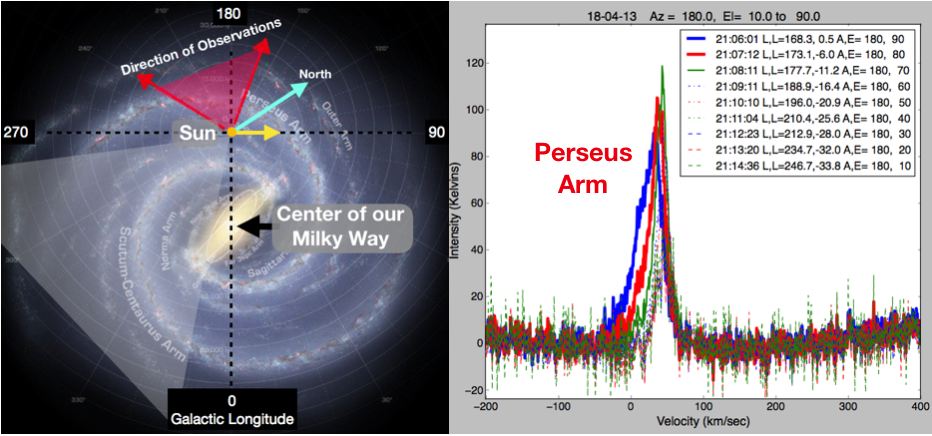

## Radio Astronomy Integrate Spectra tools built with/for Gnuradio Companion (GRC)

### These blocks are useful for Radio Astronomy Spectral Line Observations, particularly observations of our Milky Way Galaxy.

The GRC files are:

1. vectordemo.grc - Simple test block comparing the simulated data after averaging and medianing (no data source needed).

1. eventdemo.grc - Simple test block detecting events in Gaussian noise.

1. Integrate_test.grc - More complicated test function using all blocks in the NsfIntegrate Designs except
the *Osmosdr* block.

1. NsfIntegrate60.grc - Block configured to use an AIRSPY mini with 6.0 MHz bandwidth for Radio Astronomy Observations

1. NsfIntegrate60-pluto.grc - Block configured to use a PlutoSDR with 6.0 MHz bandwidth for Radio Astronomy Observations

1. NsfIntegrate20.grc - Block configured to use an RTL SDR dongle with 2.0 MHz bandwidth for Radio Astronomy Observations

The '*.ast' files contain example spectral line observations. 

The '*.hot' files contains hot-load calibration observations.  The NsfIntegrate blocks can overwrite these files.

Configuration files are used to record some input parameters and allow restarting tests and survey observations.

1.  Watch60.conf is a configuration file for the NsfIntegrate60.grc AIRSPY 6.0 MHz observing block
2.  Watch20.conf is a configuration file for the NsfIntegrate20.grc RTLSDR 2.0 MHz observing block

The Watch.not is a *Note File* describing the astronomical setup.  This file also contains a spectrum observation,
as the goal of the data header is to allow a complete re-observation, based on the previous header values.

### To test these blocks, without installing into the standard GRC path, use these commands:

`cd examples`

`export PYTHONPATH=../python:$PYTHONPATH`

and update your ~/.gnuradio/config.conf file with this path:

`local_blocks_path = ./:../grc`

Finally run the GRC files:

`gnuradio-companion vectordemo.grc`

or 

`gnuradio-companion NsfIntegrate60.grc`

### Optomizing operation

The hardkernel.com Odriod XU4 octa-core processor can capture all AIRSPY 6 MHz data if the 2 GHz processors are selected.  After recreating the design on your local computer using GRC, then exit and run python from the command line.

The linux 'taskset' command can be used to select the 2 GHz processors (number 4,5,6 and 7):

`taskset -c 4,5,6,7 python NsfIntegrate60.py`

You can use the _top_ command to see which processes are using the CPU on your computer.

Move all the other processors with the taskset commands like:

`taskset -pc 0 process-id`

Where process-id is one of the higher cpu usage processes on your device.

### Example data, formated:

Figure 1 of LightWork Memo 20: Overview of our place in the Milky Way Galaxy (Left) and 10 Minutes of Observations of the Perseus Arm. The sketch at left shows our Sun (and us) far from the center of the Milky Way. The image was drawn as if we are way above our galaxy. Our galaxy is a disk and the coordinate of the center of our galaxy is at Galactic Longitude = 0. The galactic longitude, latitude coordinates are centered on us. The plot at right shows 9 beautiful minutes of data. With some research, you can figure out that you’ve discovered the Perseus Arm of our Galaxy. The plot shows calibrated intensity (Kelvins) versus the velocity of the hydrogen measured. The observations were taken with telescope Azimuth=180 degrees, and different Elevations (A,E =). The GRC block calculates the Longitude and Latitude (L,L=) for the time of the observations (21:06 to 21:15 UTC).
 
### Documentation

http://www.opensourceradiotelescopes.org/wk

Glen Langston -- glen.i.langston@gmail.com

